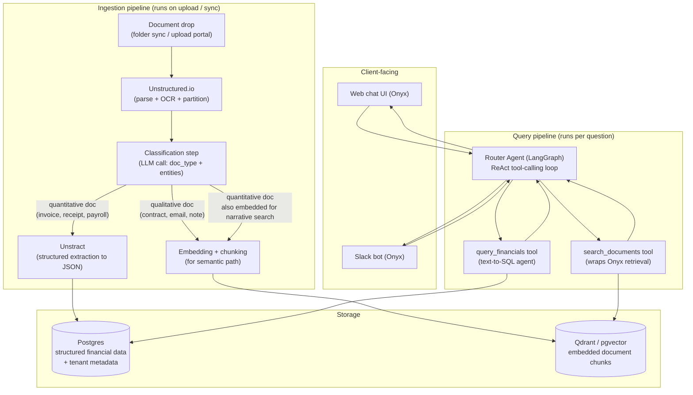

# 01 — Architecture

## Design principle

**Compose proven open-source components; build only the glue that doesn't exist yet.** Every heavy-lifting piece of this system (multi-format parsing, OCR, structured extraction, vector search, chat UI, Slack integration) has a mature open-source implementation. The genuinely novel engineering is the **classification/routing layer** that decides, per document at ingestion time and per question at query time, which of those tools should handle it — and the **product packaging** (multi-tenant deployment, onboarding UX) around all of it.

## Components and licenses

All components below were deliberately chosen to be free and open source with no required paid tier, so the cost structure is pure infrastructure + LLM API usage, not licensing (see [04-business-context.md](./04-business-context.md) for the cost/pricing math).

| Component | Role | License | Notes |
|---|---|---|---|
| **Unstructured.io** | Parses 60+ file types (PDF, DOCX, scanned images, HTML, email) into clean, typed elements (Title, NarrativeText, Table, ListItem) with OCR and layout detection | Apache 2.0 | Fully permissive, no caveats. |
| **Unstract** | LLM-driven structured extraction: turns invoices/contracts/etc. into a defined JSON schema | AGPL-3.0 (Open Source Edition) | **Use unmodified, as a standalone service called over its API.** Do not fork/patch its source — AGPL's network-copyleft clause only becomes a concern if you modify and redistribute/host a *modified* version. Paid Enterprise features (dual-LLM consensus, single-pass extraction) are cost/latency optimizations, not required for MVP. |
| **Onyx** (formerly Danswer) | Semantic search, chat UI, and Slack bot over the unstructured/qualitative document set | MIT (Community Edition) | CE includes all functionality needed here (chat, RAG, custom agents, Slack connector). Paid Enterprise Edition only gates SSO/SAML — irrelevant at this scale. |
| **Postgres** | Structured data store: extracted invoice/financial line items, per-tenant metadata, access-control records | PostgreSQL License | Also usable as the vector store via `pgvector`, simplifying ops if you don't want a separate vector DB. |
| **Qdrant** (or `pgvector`) | Vector store for embedded document chunks | Apache 2.0 | Either Qdrant standalone or `pgvector` inside the same Postgres instance is fine for MVP scale; Qdrant is the better long-term choice once vector volume/query load grows. |
| **LangGraph** (LangChain) | The routing agent: decides per question whether to call semantic search, structured SQL query, or both, and composes the final answer | MIT | This is the custom "brain" service — built on top of the library, not replaced by it. |
| **Ollama** (optional, later) | Local LLM inference for clients requiring zero data leaving their infrastructure | MIT | Not used in the MVP (see LLM strategy below) but the escape hatch for a fully air-gapped delivery model later. |
| **Docker / Docker Compose** | Packaging and deployment | Apache 2.0 | The whole stack ships as one Compose file per client. |

## System diagram



## Ingestion pipeline — step by step

1. **Drop-in.** Client uploads files through a simple portal, or a synced folder (e.g. a watched directory / Google Drive connector). No manual sorting required — this is the core UX promise.
2. **Parse.** Unstructured.io converts every file (PDF, DOCX, scanned image, email) into clean, typed text elements, running OCR where needed.
3. **Classify.** A single LLM call per document (using its parsed text, or just the first page/element for speed and cost) returns a structured label: `document_type` (`contract`, `invoice`, `hr_document`, `email`, `note`, ...), plus lightweight extracted metadata (parties involved, date, whether it contains monetary amounts). This step is the actual novel engineering — see [03-implementation-roadmap.md](./03-implementation-roadmap.md) for how to build and validate it.
4. **Branch.**
   - **Quantitative documents** (invoices, receipts, payroll records) go to Unstract, which extracts a defined JSON schema (vendor, date, amount, currency, line items) and writes it as rows into Postgres.
   - **Qualitative documents** (contracts, emails, HR files, notes) are chunked and embedded into the vector store, tagged with metadata (doc type, date, parties, source file reference).
   - **Some documents go through both paths** — e.g. an invoice's text is also embedded so a user can ask "find invoices related to office renovations" (semantic), while its numeric fields live in Postgres for "how much did we spend on renovations total" (aggregation). Classification determines which pipeline(s) a document enters, not a strict either/or.

## Query pipeline — how routing actually works

This was the open question resolved during planning: **the routing is not a hand-built classifier — it's native LLM tool-calling.** The Router Agent is a LangGraph ReAct agent given two tools with clear natural-language descriptions:

- `search_documents(query)` — "search contracts, emails, and notes for qualitative information like agreements, terms, and conversations." Internally calls Onyx's retrieval API.
- `query_financials(question)` — "answer questions about revenue, expenses, invoices, and profitability by running a database query." Internally is a text-to-SQL agent (LangChain SQL agent, or a library like Vanna.ai) running against the Postgres tables Unstract populated.

The LLM reads the incoming question and decides which tool(s) to call, in what order, and how to combine results — including multi-step questions ("which contracts drove our best month?" → calls `query_financials` to find the month, then `search_documents` filtered to that period, then synthesizes both into one answer). This pattern has first-class library support (LlamaIndex's `RouterQueryEngine`/`SQLAutoVectorQueryEngine` is a purpose-built alternative implementation of the same idea) — it does not need to be invented from scratch.

Every answer should surface its source: the specific document(s) cited for semantic answers, the SQL query and underlying rows for financial answers. This is both a trust/UX requirement and a safety requirement — see [05-risks-and-open-questions.md](./05-risks-and-open-questions.md) on hallucination risk for financial answers.

## Data model sketch

**Postgres — structured tables (per tenant):**

```
tenants (id, name, created_at, ...)

documents (
  id, tenant_id, filename, document_type, source_path,
  classification_confidence, ingested_at, raw_text_ref
)

invoices (
  id, tenant_id, document_id (fk), vendor_name, invoice_date,
  total_amount, currency, extracted_at, extraction_confidence
)

invoice_line_items (
  id, invoice_id (fk), description, quantity, unit_price, line_total
)
```

**Vector store — per chunk:**

```
chunk_text, embedding, metadata: {
  tenant_id, document_id, document_type, source_filename,
  date, parties_involved[], page_number
}
```

`tenant_id` scoping on every row/vector is non-negotiable from day one, even though the MVP uses one isolated stack per client (see deployment model below) — it costs nothing to add now and removes an entire class of future migration pain if the deployment model changes.

## LLM strategy

Two real options, and the choice matters for both cost and the privacy pitch:

- **Cloud API (recommended for MVP)** — e.g. GPT-4o-mini class model. Roughly $0.15/$0.60 per million input/output tokens; at realistic small-business query volume this is on the order of **$1–10/month per client** (see [04-business-context.md](./04-business-context.md) for the full cost breakdown). Far better answer quality than a small local model, and can be paired with an EU-region, no-training-on-data provider agreement to preserve most of the privacy pitch.
- **Local (Ollama + an open-weight model like Qwen2.5)** — zero per-token cost, but needs real compute (a GPU instance capable of running a decent model costs more per month than the API would at MVP-scale volume). Reserve this as a premium/on-prem option for clients with a hard requirement that no data ever leaves their infrastructure, not the default.

The classification step (a cheap, high-frequency call) and the router/answer-generation step (fewer calls, needs more reasoning quality) can use different models if useful for cost control — this is a tuning decision for [03-implementation-roadmap.md](./03-implementation-roadmap.md), not an architectural one.

## Deployment model

Two delivery models, same Docker Compose bundle:

1. **You-hosted, isolated-per-client (MVP default).** One full stack (Postgres + vector store + Onyx + Unstract + router service) per client, deployed on EU infrastructure (e.g. Hetzner). Data for each client lives in physically/logically separate containers and databases — never a shared multi-tenant table across customers. This preserves the "EU-hosted, isolated, nobody else touches your data" pitch while keeping updates and support entirely in your control.
2. **True on-premise, client-hosted (later, premium tier).** Same bundle handed to the client to run on their own server. Strongest possible privacy story, but requires a versioned release/update mechanism and much harder support since you don't control the infrastructure. Not the starting point — introduce this once there's a working product and a support process.

As client count grows, multiple clients' isolated containers can move onto one larger, more cost-efficient shared server (still logically separated by container/database, never by shared tables) to improve hosting margins — see the margin math in [04-business-context.md](./04-business-context.md).
